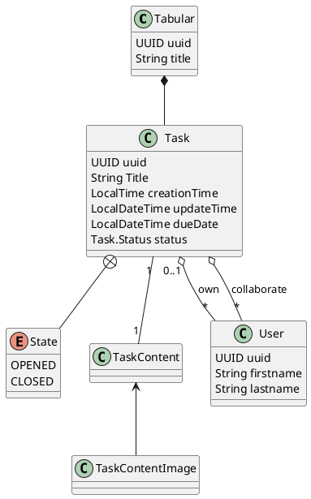

# A simple JPA example : A Todo List

## Usage

Launch H2 : 
```shell
./runH2.sh
```
Clone this repository.

Compile, package, and run Integration Tests (verify) and launch the sample app.


```puml
@startuml
'https://plantuml.com/class-diagram

class Tabular {
UUID uuid
String title
}


class Task{
UUID uuid
String Title
LocalTime creationTime
LocalDateTime updateTime
LocalDateTime dueDate
Task.Status status
}
enum State {
  OPENED
  CLOSED
 }

Task+--State

class TaskContent {
}
class TaskContentImage {
}

class User {
UUID uuid
String firstname
String lastname
}

Tabular *-- Task

Task "0..1" o-- "*" User: own
Task o-- "*" User : collaborate
Task "1" -- "1" TaskContent

TaskContent <-- TaskContentImage
@enduml
```

